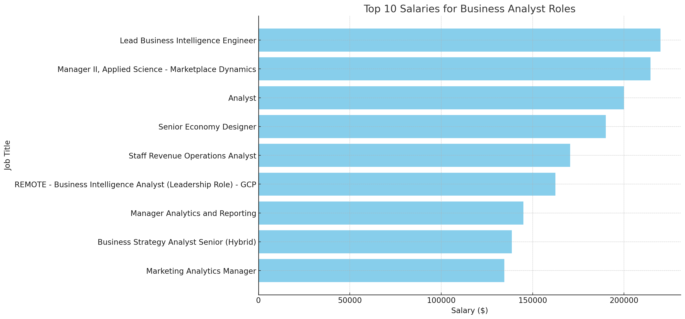
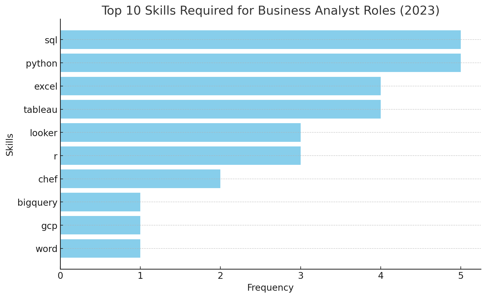

# INTRODUCTION
📊 Dive into the job market! Focusing on business analyst roles, this project explores 💰top-paying jobs,🔥in-demand skills,and 📈where high demand meets high salary

🔎SQL queries? Check them out here: [sql_project folder](/sql_project/)
# BACKGROUND
Driven by a quest to navigate the Business Analyst job market more effectively,this project was born from a desire to pinpoint top-paid  and  in-demand skills, streamlining others work to find optimal jobs.
Data hails from [SQL Course](https://lukebarousse.com/sql). It is packed with insights
on job titles, salaries, Locations, and essential
skills.
### The questions I wanted to answer through my
SQL queries were:
1. What are the top-paying Business analyst jobs?
2. What skills are  required for these top-paying jobs?
3. What skills are most in demand for Business analysts?
4. Which skills are associated with higher salaries?
5. What are the most optimal skills to learn?

# TOOLS I USED
For my deep dive into the Business analyst job market I harnessed the power of several key tools:
- **SQL:** The backbone of my analysis, allowing me to query the database and unearth critical insights.
- **PostgresQL:** The chosen  database management system, ideal for handling the job posting data.
- **visual Studio Code:** My go-to for databaseVisual management and executing SQL queries.
- **Git & GitHub:** Essential for version control and sharing my SQL scripts and analysis. ensuring collaboration and project tracking.


# THE ANALYSIS
Each query for this project aimed at investigating specific aspects of the Business analyst job market. Here’s how I approached each question:
### 1. Top Paying Data Analyst Jobs
To identify the highest-paying roles, I filtered Business analyst positions by average yearly salary and location, focusing on remote jobs. This query highlights the high paying opportunities in the field.
```sql
SELECT 
    job_id,
    job_title,
    job_location,
    job_schedule_type,
    salary_year_avg,
    job_posted_date,
    name AS company_name
FROM
    job_postings_fact
LEFT JOIN company_dim ON job_postings_fact.company_id=company_dim.company_id
WHERE
    job_title_short='Business Analyst' AND
    job_location='Anywhere' AND
    salary_year_avg IS NOT NULL 
ORDER BY
    salary_year_avg DESC 
LIMIT 10;
```
Insights on Top-Paying Remote Business Analyst Roles:
- **Narrow Salary Range:** The top-paying business analyst roles range from $134,550 to $220,000, indicating that while there is lucrative potential in the field, the salary range is relatively narrow compared to other high-demand roles. This suggests a more consistent valuation of business analyst positions across companies.
- **Consistent Demand Across Industries:** Companies like Noom, Uber, and Multicoin Capital are offering high salaries for business analyst roles, highlighting the strong and consistent demand for analytical expertise across different sectors, from health tech to ride-sharing and finance.
- **Specialized Roles with High Rewards:** There is a variety in job titles such as Lead Business Intelligence Engineer, Manager II, Applied Science, and Analyst, reflecting the diverse specializations within the business analyst domain. These specialized roles offer higher rewards, emphasizing the importance of targeted skills and experience in securing top-paying positions.

*Bar graph visualizing the salary for the top 10 salaries for Business analysts; ChatGPT generated this graph from my SQL query results*
### 2. Skills for Top Paying Jobs
To understand what skills are required for the top-paying jobs, I joined the job postings with the skills data, providing insights into what employers value for high-compensation roles.
```sql
WITH top_paying_jobs AS(
    SELECT 
        job_id,
        job_title,
        salary_year_avg,
        name as company_name
    FROM
        job_postings_fact
    LEFT JOIN company_dim ON job_postings_fact.company_id=company_dim.company_id
    WHERE
        job_title_short='Business Analyst' AND
        job_location='Anywhere' AND
        salary_year_avg IS NOT NULL 
    ORDER BY
        salary_year_avg DESC 
    LIMIT 10
)
SELECT 
    top_paying_jobs.*,
    skills
FROM
    top_paying_jobs
INNER JOIN skills_job_dim ON top_paying_jobs.job_id=skills_job_dim.job_id
INNER JOIN skills_dim ON skills_job_dim.skill_id=skills_dim.skill_id
ORDER BY
    salary_year_avg DESC
```

The analysis of the skill column from the job postings shows the following insights:

- **Top Skills:** SQL and Python are the most frequently listed skills, each appearing 5 times.
Excel and Tableau are also commonly required, appearing 4 times each.
- **Other Skills:** Looker and R appear twice, indicating their relevance in some roles.Less common but still listed skills include Chef, BigQuery, GCP, and Word, each appearing once.

*Bar graph visualizing the count of skills for the top 10 paying jobs for Business analysts; ChatGPT generated this graph from my SQL query results*
### 3. In-Demand Skills for Buisness Analysts
This query helped identify the skills most frequently requested in job postings, directing focus to areas with high demand.
```sql
SELECT
    skills,
    COUNT(skills_job_dim.job_id) AS demand_count
FROM job_postings_fact
INNER JOIN skills_job_dim ON job_postings_fact.job_id=skills_job_dim.job_id
INNER JOIN skills_dim ON skills_job_dim.skill_id=skills_dim.skill_id
WHERE
    job_title_short='Business Analyst' AND
    job_work_from_home=TRUE
GROUP BY 
    skills 
ORDER BY 
    demand_count DESC
LIMIT 5;
```
Insights on Skills Demand:
- **SQL Leads the Demand:** SQL is the most in-demand skill, with 1,266 job postings requiring it. This highlights its fundamental importance in data-related roles, as SQL is essential for managing and querying databases.
- **Excel Remains a Core Skill:** With 983 job postings, Excel is the second most demanded skill. Despite the rise of more advanced tools, Excel remains a crucial tool for data analysis, reporting, and day-to-day business operations.
- **Visualization Tools are Highly Valued:** Tableau (728 demand count) and Power BI (555 demand count) are both in high demand, reflecting the importance of data visualization skills in making data-driven insights accessible and actionable for business decisions.
- **Python’s Growing Importance:** Python, with 546 demand count, shows strong demand, especially in roles requiring more advanced data analysis, automation, and machine learning capabilities. Its versatility and wide range of applications in data science make it a valuable skill.


| Skills   | Demand Count |
|----------|--------------|
| SQL      | 1266         |
| Excel    | 983          |
| Tableau  | 728          |
| Power BI | 555          |
| Python   | 546          |  

*Table of the demand for the top 5 skills in Business Analyst job postings*

### 4. Skills Based on Salary
Exploring the average salaries associated with different skills revealed which skills are the highest paying.
```sql
SELECT 
    skills,
    ROUND(AVG(salary_year_avg),0) AS avg_salary
FROM job_postings_fact
INNER JOIN skills_job_dim ON job_postings_fact.job_id=skills_job_dim.job_id
INNER JOIN skills_dim ON skills_job_dim.skill_id=skills_dim.skill_id
WHERE
    job_title_short='Business Analyst' AND 
    salary_year_avg IS NOT NULL
    --job_work_from_home=TRUE
GROUP BY 
    skills 
ORDER BY     
    avg_salary DESC
LIMIT 25;
```
Here are some trends and insights based on the top-paying skills for business analysts:

- **Advanced Data Analysis and Machine Learning**  *Skills:* Numpy, Pytorch, TensorFlow, Scikit-learn
*Trend:* Skills related to advanced data analysis and machine learning command higher salaries. Proficiency in these tools and frameworks indicates a strong capability in handling complex data tasks and predictive modeling, which is highly valued.

- **Specialized Data Tools and Technologies**
Skills: Hadoop, Snowflake, Looker, Elasticsearch, MongoDB
Trend: Familiarity with specialized data processing and analysis tools, including big data technologies and data visualization platforms, is lucrative. These tools are essential for managing large datasets and extracting actionable insights.

- **Emerging Technologies**
Skills: Julia, Airflow, Phoenix
Trend: Emerging and specialized technologies often offer higher salaries due to their novelty and the specific expertise required. Julia, for instance, is appreciated for its performance in numerical computing, while Airflow and Phoenix serve unique roles in data workflows and web frameworks.

- **Core Programming and Development Skills**
Skills: Ruby, C, Node.js, Electron
Trend: Traditional programming skills remain important and well-compensated, especially when applied to software development and application design. Ruby, C, and JavaScript (Node.js) are foundational in various tech stacks.

- **Visualization and Reporting Tools**
Skills: Seaborn, Matlab, Matplotlib, Pandas
Trend: Visualization and reporting skills are crucial for interpreting and presenting data effectively. Proficiency in tools and libraries that aid in data visualization (like Seaborn and Matplotlib) and analysis (like Pandas) is highly valued.

- **Cloud and Big Data Technologies**
Skills: Snowflake, Cassandra
Trend: Cloud-based and big data technologies are increasingly important as organizations scale and require more robust data solutions. Expertise in these areas reflects an ability to manage and analyze large volumes of data effectively.

**Summary:**
High salaries often correlate with skills in advanced analytics, machine learning, and specialized technologies.
Emerging technologies and cutting-edge tools are increasingly in demand and command higher compensation.
Core programming skills and data visualization capabilities remain critical and well-compensated.

| Skills         | Average Salary ($) |
|----------------|-------------------:|
| Chef           |            220,000 |
| Numpy          |            157,500 |
| Ruby           |            150,000 |
| Hadoop         |            139,201 |
| Julia          |            136,100 |
| Airflow        |            135,410 |
| Phoenix        |            135,248 |
| Electron       |            131,000 |
| C              |            123,329 |
| Pytorch        |            120,333 |
| TensorFlow     |            120,333 |
| Seaborn        |            120,000 |
| Matlab         |            120,000 |
| Matplotlib     |            120,000 |
| Scikit-learn   |            120,000 |
| NoSQL          |            119,330 |
| MongoDB        |            118,667 |
| Snowflake      |            112,543 |
| Looker         |            110,581 |
| Pandas         |            110,558 |
| Node.js        |            110,000 |
| Elasticsearch  |            110,000 |
| MXNet          |            110,000 |
| Chainer        |            110,000 |
| Cassandra      |            108,488 |

*Table of the average salary for the top 25 paying skills for Business analysts*

### 5. Most Optimal Skills to Learn
Combining insights from demand and salary data, this query aimed to pinpoint skills that are both in high demand and have high salaries, offering a strategic focus for skill development.
```sql
SELECT  
    skills_dim.skill_id,
    skills_dim.skills,
    COUNT(skills_job_dim.job_id) AS demand_count,
    ROUND(AVG(job_postings_fact.salary_year_avg),0) AS avg_salary
FROM job_postings_fact
INNER JOIN skills_job_dim ON job_postings_fact.job_id=skills_job_dim.job_id
INNER JOIN skills_dim ON skills_job_dim.skill_id=skills_dim.skill_id
WHERE 
    job_title_short='Business Analyst'
    AND salary_year_avg IS NOT NULL
    AND job_work_from_home=TRUE
GROUP BY 
    skills_dim.skill_id
HAVING 
    COUNT(skills_job_dim.job_id)>10
ORDER BY 
    avg_salary DESC,
    demand_count DESC
```
Insights Based on the Provided Data:

- **High Demand for SQL and Excel Skills:** SQL and Excel are foundational skills in data analysis and business intelligence, with SQL having the highest demand count (42) and a strong average salary ($99,120). Excel also has a significant demand (31) and offers a competitive average salary ($94,132), indicating its continued importance in data manipulation and reporting.

- **Moderate Demand but Higher Salaries for Python:** Despite having a lower demand count (20), Python commands the highest average salary ($116,516) among the listed skills. This reflects Python’s versatility and importance in more advanced data analysis, machine learning, and automation tasks, which are highly valued and well-compensated.

- **Strong Demand for Tableau and Power BI in Data Visualization:**  Tableau and Power BI are in demand as key tools for data visualization and business intelligence. Tableau has a higher demand count (27) and offers a higher average salary ($104,233), indicating its strong presence in the industry. Power BI, while having a lower demand count (12), still commands a respectable salary ($90,448), showing its importance in certain business sectors.

**Summary:**
SQL and Excel are in high demand, underscoring their importance in everyday data management and analysis tasks.
Python stands out for its higher salary potential, highlighting its value in advanced data-related roles.
Tableau and Power BI are crucial for data visualization, with Tableau having slightly higher demand and salary, making it a valuable skill for data analysts and business intelligence professionals.

| Skill ID | Skills  | Demand Count | Average Salary ($) |
|----------|---------|--------------|-------------------:|
| 1        | Python  | 20           |            116,516 |
| 182      | Tableau | 27           |            104,233 |
| 0        | SQL     | 42           |             99,120 |
| 181      | Excel   | 31           |             94,132 |
| 183      | Power BI| 12           |             90,448 |

*Table of the most optimal skills for Business analyst sorted by salary*
# WHAT I LEARNED 
Over the course of this SQL journey, I've equipped myself with some powerful data-wrangling skills:

**🚀 Advanced Query Craftsmanship:** Mastered intricate SQL techniques, seamlessly joining tables and harnessing the magic of WITH clauses for dynamic, temporary results.

**📊 Data Aggregation Mastery:** Became adept at using GROUP BY and essential aggregate functions like COUNT() and AVG(), turning raw data into insightful summaries and reports.

**🔍 Analytical Acumen:** Elevated my problem-solving prowess by transforming complex questions into actionable, insightful SQL queries that reveal hidden patterns and trends.
# CONCLUSIONS
### Insights
From the analysis, several general insights emerged:

1. **Top-Paying Data Analyst Jobs**: The highest-paying jobs for business analysts that allow remote work offer a wide range of salaries, the highest at $220,000!
2. **Skills for Top-Paying Jobs**: High-paying business analyst jobs require advanced proficiency in SQL, suggesting it’s a critical skill for earning a top salary.
3. **Most In-Demand Skills**: SQL is also the most demanded skill in the business analyst job market, thus making it essential for job seekers.
4. **Skills with Higher Salaries**: Specialized skills, such as Snowflake and matlab, are associated with the highest average salaries, indicating a premium on niche expertise.
5. **Optimal Skills for Job Market Value**: SQL leads in demand and offers for a high average salary, positioning it as one of the most optimal skills for business analysts to learn to maximize their market value.

### Closing Thoughts

This project enhanced my SQL skills and provided valuable insights into the business analyst job market. The findings from the analysis serve as a guide to prioritizing skill development and job search efforts. Aspiring business analysts can better position themselves in a competitive job market by focusing on high-demand, high-salary skills. This exploration highlights the importance of continuous learning and adaptation to emerging trends.